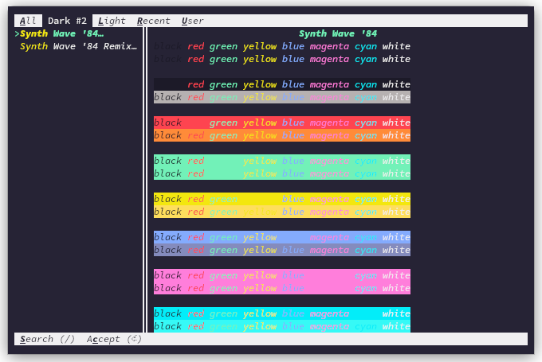
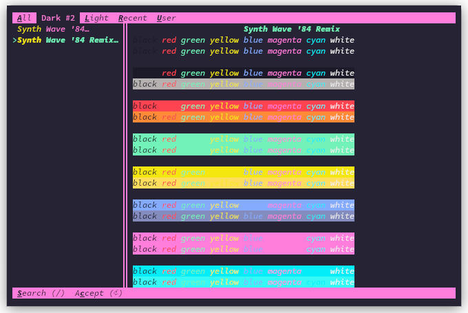

# SynthWave '84 - Kitty


Colour themes for Kitty based on
[SynthWave '84](https://github.com/robb0wen/synthwave-vscode).





## Installation

```bash
mkdir -p ~/.config/kitty/themes
cd ~/.config/kitty/themes
git clone git@github.com:spmarsden/synthwave-84-kitty.git
ln -s "synthwave-84-kitty/*.conf ./"
```

The theme will now be visible when using

```bash
kitty +kitten themes
```

or you can add one of the following line to the end of `~/.config/kitty/kitty.conf`:

```text
include themes/SynthWave '84.conf
include themes/SynthWave '84 Remix.conf
```

## Thanks

Many thanks to [Rob Owen](https://github.com/robb0wen) for the original theme,
(and from whom I stole the banner from), and to
[Unsplash](https://unsplash.com/photos/DxHR8K5Egjk) for the original city
skyline.
